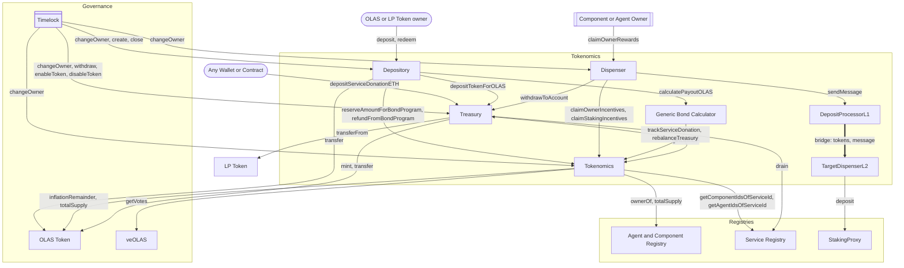

# Tokenomics Flowchart

```mermaid
graph TD
    %% Tokenomics
    subgraph tokenomics [Tokenomics]
    Treasury[Treasury]
    Dispenser[Dispenser]
    Tokenomics[Tokenomics]
    Depository[Depository]
    GenericBondCalculator[Generic Bond Calculator]
    DepositProcessorL1[DepositProcessorL1]
    TargetDispenserL2[TargetDispenserL2]
    end
    
    subgraph governance [Governance]
    OLAS_Token[OLAS Token]
    Timelock@{ shape: div-rect, label: "Timelock" }
    veOLAS[veOLAS]
    end
    
    subgraph registries [Registries]
    AgentRegistry[Agent and Component Registry]
    ServiceRegistry[Service Registry]
    StakingProxy[StakingProxy]
    end
    
    LP_Token[LP Token]
    Owner([OLAS or LP Token owner])
    OwnerAgent[[Component or Agent Owner]]
    AnyWallet([Any Wallet or Contract])
    
    AnyWallet-->|depositServiceDonationETH|Treasury
    DepositProcessorL1==>|bridge: tokens, message|TargetDispenserL2
    Depository-->|calculatePayoutOLAS|GenericBondCalculator
    Depository-->|reserveAmountForBondProgram, refundFromBondProgram|Tokenomics
    Depository-->|depositTokenForOLAS|Treasury
    Depository-->|transfer|OLAS_Token
    Dispenser-->|claimOwnerIncentives, claimStakingIncentives|Tokenomics
    Dispenser-->|sendMessage|DepositProcessorL1
    Dispenser-->|withdrawToAccount|Treasury
    GenericBondCalculator-->|getLastIDF|Tokenomics
    Owner-->|deposit, redeem|Depository
    OwnerAgent-->|claimOwnerRewards|Dispenser
    TargetDispenserL2-->|deposit|StakingProxy
    Timelock-->|changeOwner|Dispenser
    Timelock-->|changeOwner|Tokenomics
    Timelock-->|changeOwner, create, close|Depository
    Timelock-->|changeOwner, withdraw, enableToken, disableToken|Treasury
    Treasury<-->|trackServiceDonation, rebalanceTreasury|Tokenomics
    Tokenomics-->|ownerOf, totalSupply|AgentRegistry
    Tokenomics-->|getComponentIdsOfServiceId, getAgentIdsOfServiceId|ServiceRegistry
    Tokenomics-->|inflationRemainder, totalSupply|OLAS_Token
    Tokenomics-->|getVotes|veOLAS
    Treasury-->|drain|ServiceRegistry
    Treasury-->|transferFrom|LP_Token
    Treasury-->|mint, transfer|OLAS_Token
```
